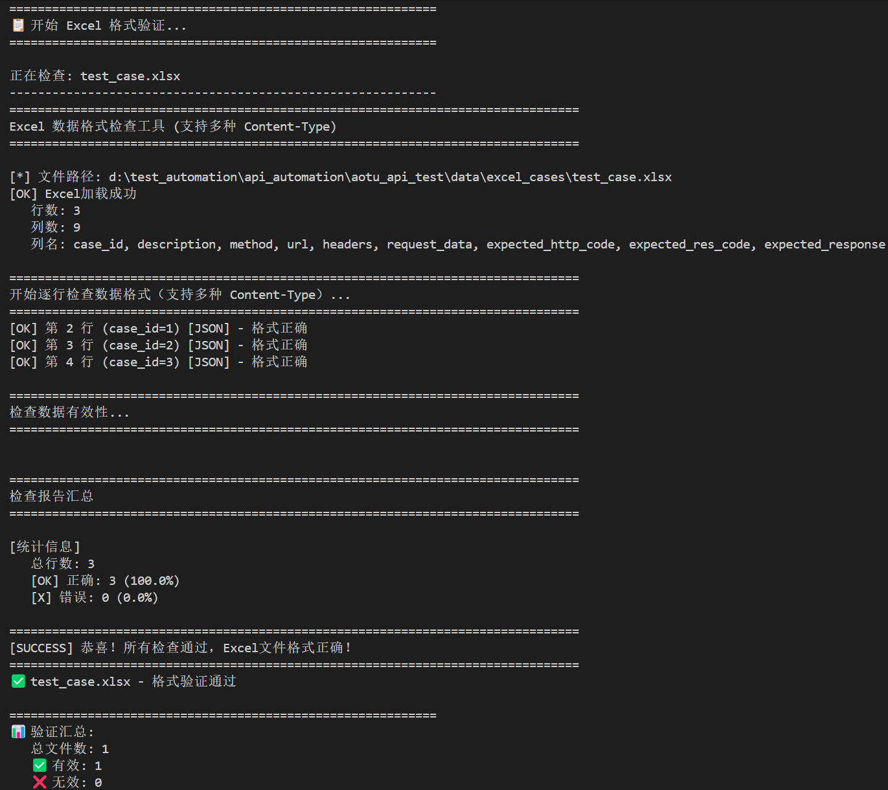
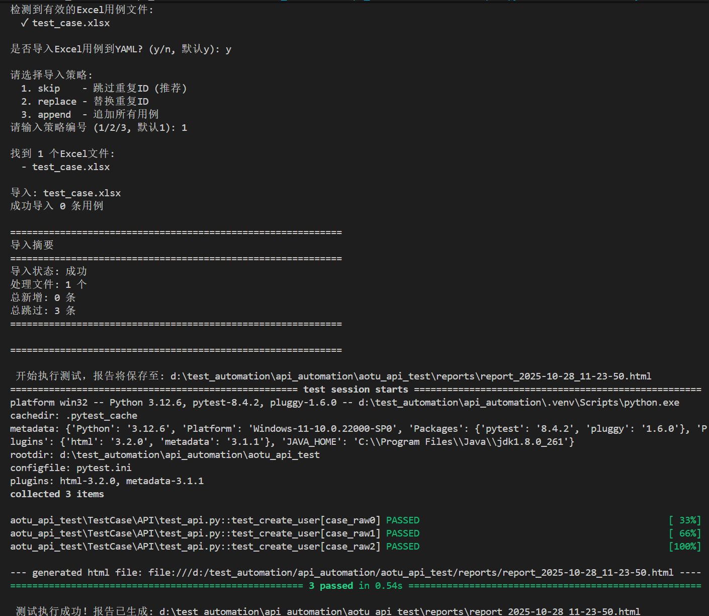

# API 自动化测试框架

基于 PyTest 的轻量级 API 自动化测试框架，支持 YAML/Excel 数据驱动，内置日志与 HTML 报告，提供可选的 Excel→YAML 导入流程。

## 自动导入 Excel 后执行测试（推荐）
python run.py -i

## 交互式导入 + 执行
python run.py

## 指定导入策略
```
python run.py -i -s skip      # 跳过重复（默认）
python run.py -i -s replace   # 覆盖重复
python run.py -i -s append    # 直接追加
```

## 🧭 项目结构

```
aotu_api_test/
├─ base/                   # 请求封装、断言、日志
├─ config/                 # 全局配置
├─ data/
│  ├─ test_cases.yaml      # 主用例
│  ├─ excel_cases/         # Excel 用例入口
│  └─ templates/           # Excel 模板
├─ logs/                   # 运行日志
├─ reports/                # HTML 报告
├─ TestCase/API/           # 测试集合
├─ utils/                  # YAML/动态数据/导入框架
├─ scripts/                # 清理与检查脚本
└─ run.py                  # 入口
```

## 📥 Excel 用例导入

- 模板位置：`data/templates/test_case_template.xlsx`
- 必填列：`case_id`、`description`、`method`、`url`、`expected_http_code`、`expected_res_code`
- 可选列（JSON 字段）：`headers`、`request_data`、`expected_response`

JSON 字段必须是标准 JSON：
- 目前项目已经支持自动化的格式检验，注意用例文件名称必须为：**test_case.xlsx**

```json
// 正确
{"name": "test", "age": 25}
// 错误（缺少引号、中文标点、多余逗号）
{name: 'test', age: 25,}
```


## 📦 Content-Type 支持

以下表格说明 `headers.Content-Type` 与 `request_data` 的书写要求及发送方式；对应 Excel 模板位于 `data/templates/test_case_template.xlsx`。

| Content-Type                       | request_data 写法 | 发送方式        | 备注 |
|-----------------------------------|-------------------|-----------------|------|
| application/json                  | JSON 对象         | json 参数       | 标准 JSON |
| application/x-www-form-urlencoded | JSON 对象         | data 参数（表单）| 自动表单编码 |
| multipart/form-data               | JSON 对象         | 自动 multipart  | 不手动设置 boundary |
| text/plain                        | 字符串            | data 参数       | 纯文本发送 |
| application/xml                   | 字符串或 JSON     | data 参数       | 按文本发送或先转字符串 |

YAML 示例：

```yaml
# JSON
headers:
  Content-Type: application/json
request_data:
  username: test
  password: "123456"
```

```yaml
# Form（数据仍用 JSON 结构描述）
headers:
  Content-Type: application/x-www-form-urlencoded
request_data:
  username: admin
  password: "123456"
```

```yaml
# Multipart（boundary 由 requests 自动处理）
headers:
  Content-Type: multipart/form-data
request_data:
  file: test.txt
  description: 测试文件
```

```yaml
# Text / XML 按纯文本发送
headers:
  Content-Type: text/plain   # 或 application/xml
request_data: "<xml>hello</xml>"
```

提示：若未显式指定 `Content-Type`，框架默认按 `application/json` 处理。

## 🔧 动态数据

- 占位符格式：`{{name[:seed]}}`
- 常用生成器：`generate_username`、`generate_email`、`generate_phone`、`generate_age`

示例：

```yaml
request_data:
  username: "{{generate_username:admin}}"
  email: "{{generate_email:test}}"
  phone: "{{generate_phone}}"
  age: "{{generate_age:25}}"
```

## 📊 报告与日志

- 测试报告：`reports/report_YYYY-MM-DD_HH-MM-SS.html`
- 运行日志：`logs/test_YYYY-MM-DD_HH-MM-SS.log`

## 🧹 常用脚本

```powershell
# 清理缓存/日志/报告（7 天前）
python scripts/cleanup.py

# 仅清理指定类型
python scripts/cleanup.py --cache
python scripts/cleanup.py --logs
python scripts/cleanup.py --reports

# Excel JSON 格式检查
python scripts/check_excel_json.py
```

## ❓常见问题

**Excel 导入无变化？** 可能因 `skip` 策略跳过了重复 `case_id`，可改用 `replace` 或 `append`。

**JSON 解析失败？** 先运行 `python scripts/check_excel_json.py` 定位并修复（注意双引号与英文标点）。

**如何修改 BASE_URL？** 设置 `.env` 或直接修改 `config/settings.py`。

---

## 📝 更新日志

### 2025-10-28 - v1.2.0
**🎯 更新：集成 Excel 格式验证到导入流程**

#### 一、新增功能
- ✅ **自动格式验证**：在导入 Excel 用例前自动执行格式检查
  - 集成 `ExcelJsonChecker` 到 `ExcelCaseLoader`
  - 支持多种 Content-Type 格式验证（JSON、Form、Multipart、XML、Text）
  - 详细的错误报告和修复建议
  
- ✅ **断言逻辑优化**：重构测试层断言
  - 在 `base.assertion` 中新增 `assert_case()` 聚合方法
  - 统一执行：状态码 → JSON解析 → 业务码 → 响应内容
  - 测试代码从 127 行简化到 63 行

- ✅ **请求参数自动处理**：封装 Content-Type 逻辑
  - 在 `base.request` 中新增 `prepare_request_params()` 方法
  - 自动识别并处理多种 Content-Type
  - 支持不区分大小写的 header 键名

#### 二、优化改进
- 🔧 **移除重复验证**：删除 `ImportManager` 中的冗余格式检查
  - 避免 `utils.excel_validator` 模块不存在的错误
  - 职责更清晰：`ExcelCaseLoader` 负责验证，`ImportManager` 负责导入

- 🚀 **导入流程优化**
  ```
  文件存在检查 → 格式验证 → 用户确认 → 数据导入 → 测试执行
  ```
  - 格式验证失败时立即退出（`sys.exit(1)`）
  - 更清晰的进度提示和错误反馈

#### 三、终端输出结果





最后更新：2025-10-28

